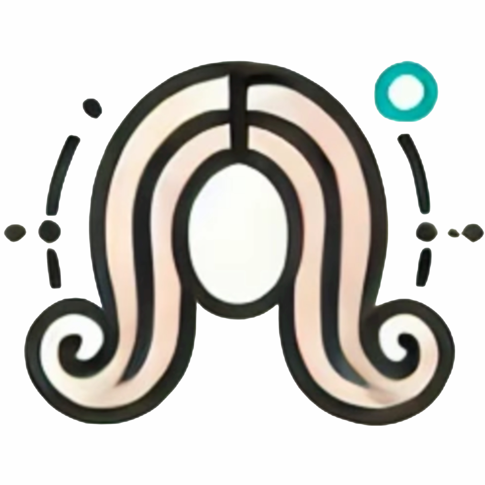
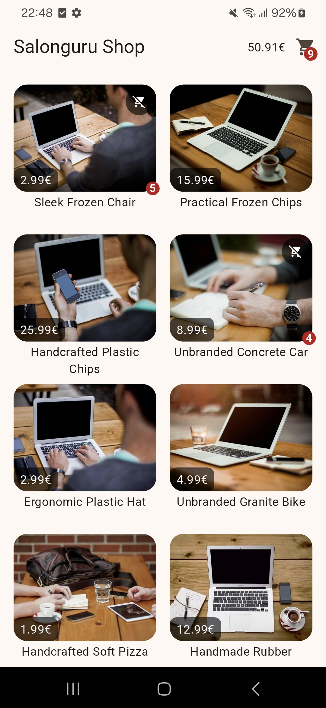
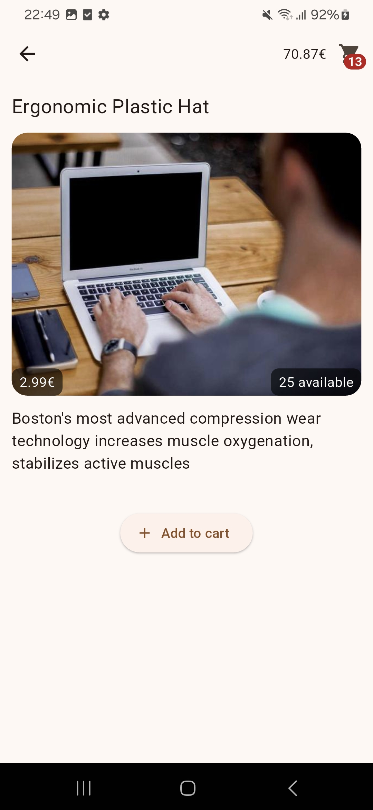
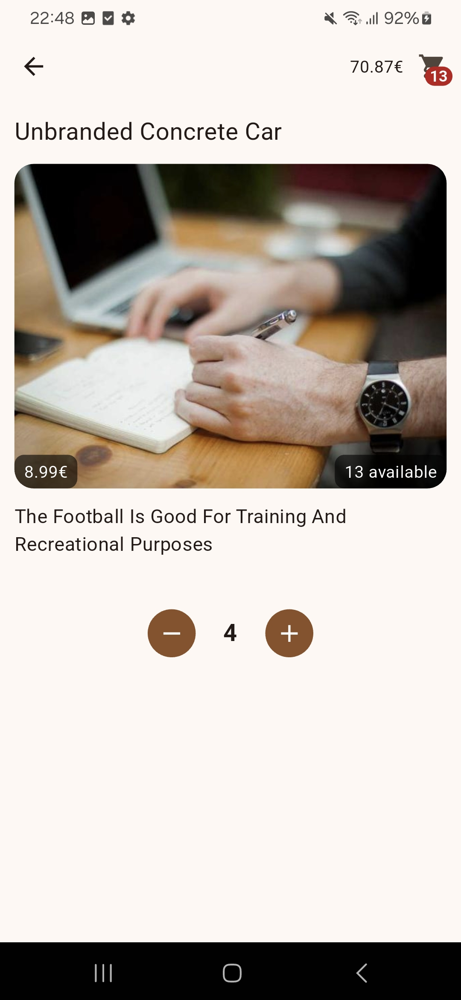
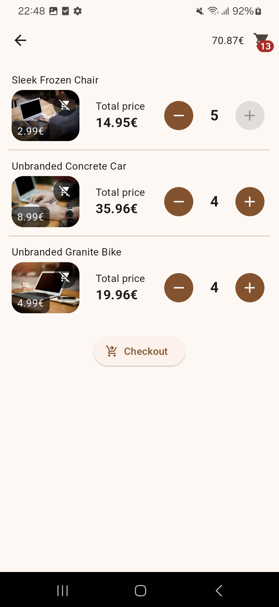
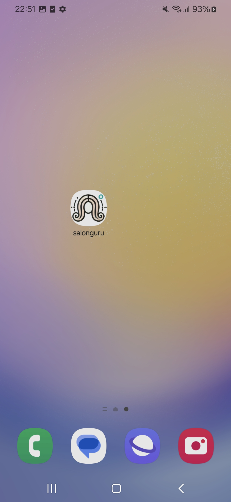

# Salonguru

<!-- TOC -->

- [Salonguru](#salonguru)
  - [Project Overview](#project-overview)
  - [Screenshots](#screenshots)
  - [Demo video](#demo-video)
  - [Installation](#installation)
  - [Assumptions](#assumptions)
  - [Features](#features)
    - [Completed Features](#completed-features)
    - [Incomplete Features](#incomplete-features)
    - [Not considered](#not-considered)
    - [Todos](#todos)
  - [Project Architecture](#project-architecture)
  - [Android app (apk)](#android-app-apk)

<!-- /TOC -->

## Project Overview

This project is a mobile application built using Flutter in the context a job interview assignment. Is not a complete project and is not intended to be, including this READ.me file.

---

## Screenshots








---

## Demo video

[Link to demo video](demo/demo.mp4)

---

## Installation

Follow these steps to install and run the project locally:

1. **Clone the repository:**

   ```bash
   git clone https://github.com/nuunoo1977/salonguru.git
   ```

2. **Navigate to the project directory:**

   ```bash
   cd salonguru
   ```

3. **Install dependencies:**

   ```bash
   flutter pub get
   ```

4. **Run the application:**

   ```bash
   flutter run
   ```

Ensure you have Flutter installed on your machine. For more information, visit the [Flutter installation guide](https://flutter.dev/docs/get-started/install).


---

## Assumptions

In a real work scenario, many questions for the client would be asked before starting the implementation. But in this case, reasonable assumptions were made that can be explained during the discussion.

---

## Features

### Completed Features

- Products list page
- Products detail page where user can add the product to the cart
- Cart detail page where user can edit the products that are in the cart and execute the checkout
- Persistence of the cart state (saved in SharedPreferences)
- Uncompleted version of checkout (request is submitted to the server and the success/failure is checked), showing message to the user

### Incomplete Features

- Complete parse of Checkout response and overview page of the result

### Not considered

- Localization
- Tests
- Exclude *.emv from repository
- Cache of network images
- Responsive design for landscape mode or tablets
- ...

### Todos

TODO comments are included throughout the code to highlight issues or features that would be addressed in a real-world scenario.

---

## Project Architecture

The project tries to follow Clean Architecture principles and the main packages/tools used are:

* BLOC (State Management)
* GetIt / Injectable (Dependency Injection)
* DIO (Http Client)


---

## Android app (apk)

[Download APK](demo/salonkee.apk)

